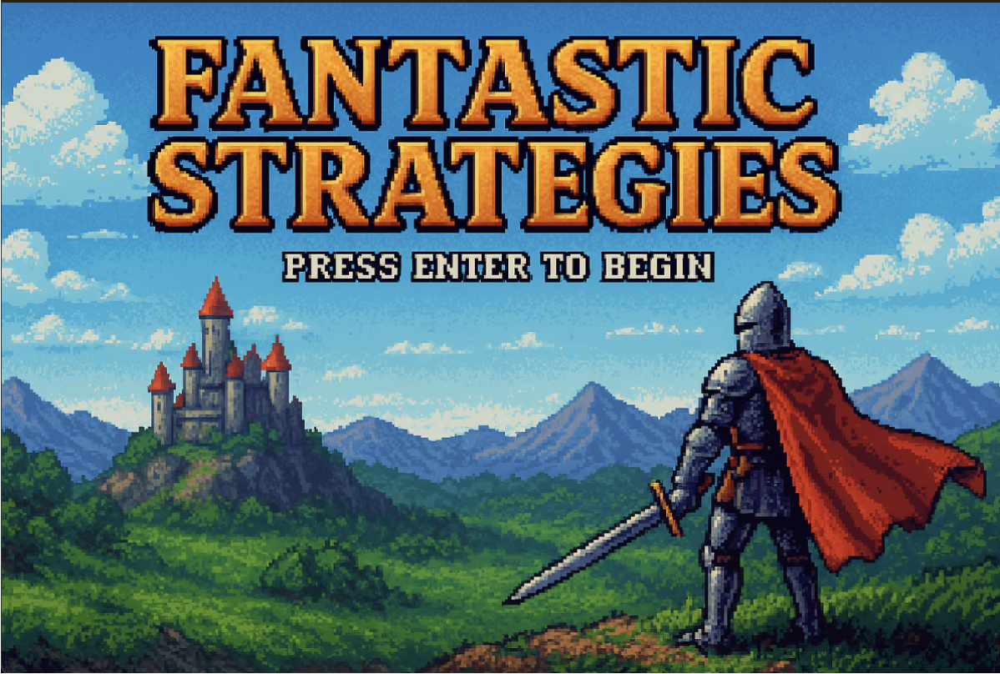
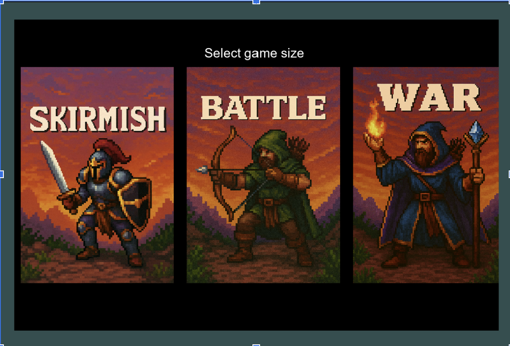
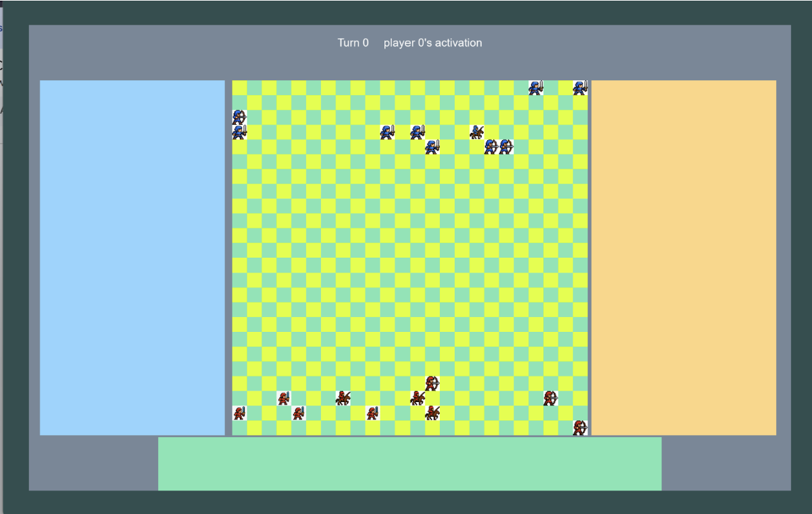
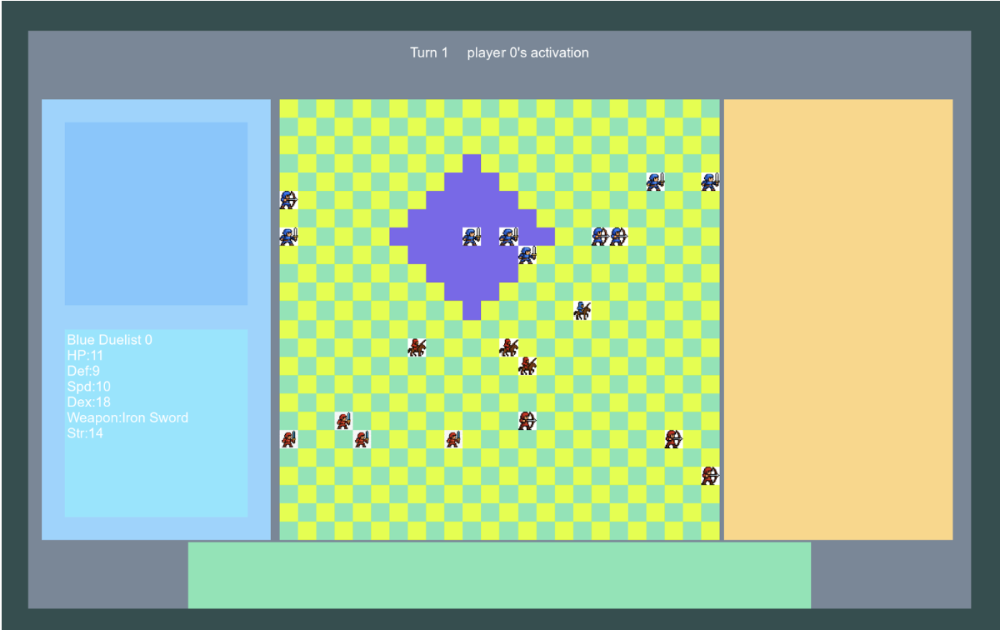
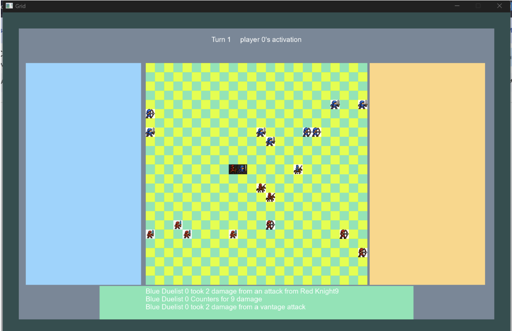
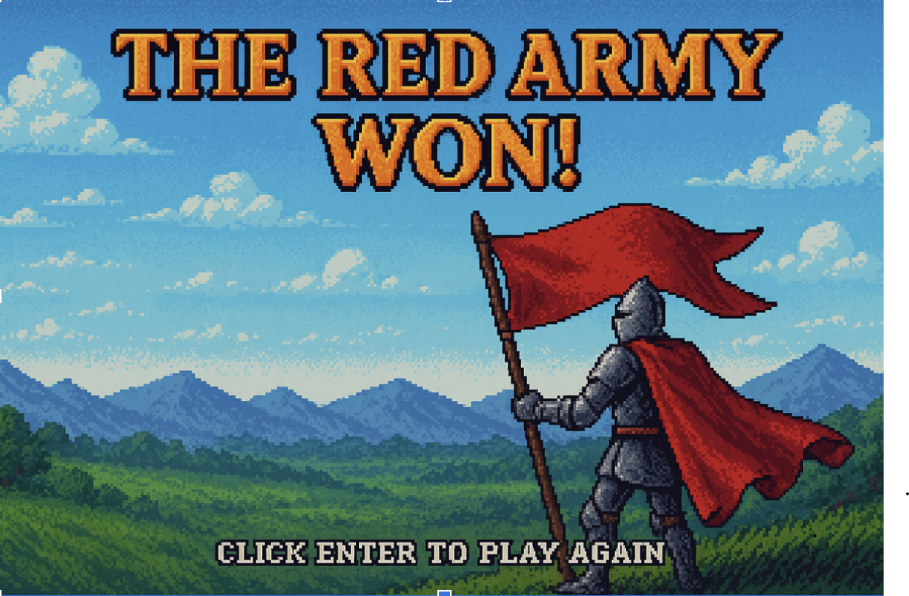
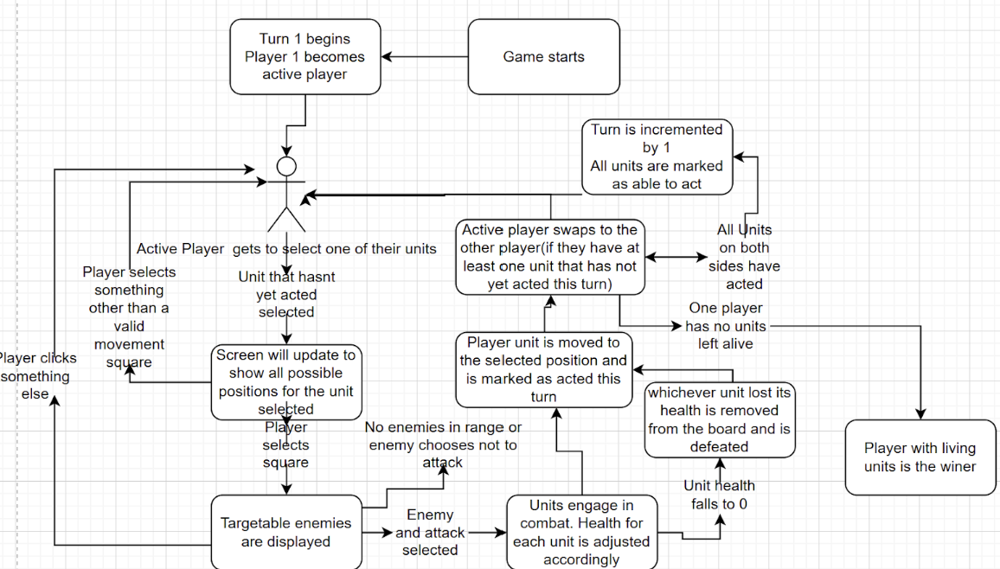
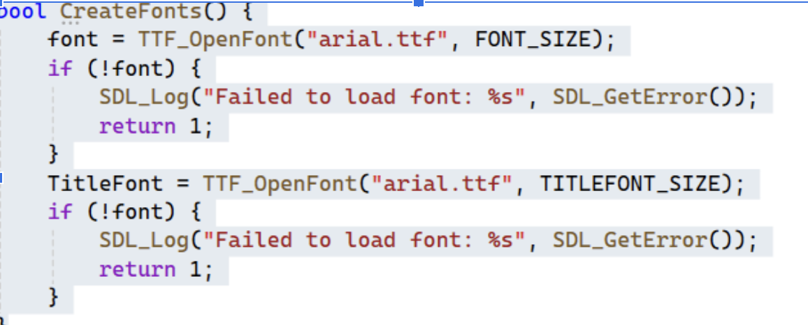

# Comp 3016 Course work 1

## Fantastic Strategies

## A turn based tactical game 

By Harry Watton

## Video link {#video-link}

[https://youtu.be/jjydHaxuhus](https://youtu.be/jjydHaxuhus) 

## Git link {#git-link}

[https://github.com/harry-jw-plymouth/3016-CW1.git](https://github.com/harry-jw-plymouth/3016-CW1.git) 

# Gameplay 

## Gameplay description 

The game is a turn based strategy game, where 2 players each control a varying team of fantasy styled soldiers which take it in turns to move and fight. Each player will get alternating turns to ‘activate’ their units. Once a unit has been activated it will be unavailable to activate until the next turn.   
The game takes place on a grid of squares, where once they have moved theur units close enough to an enemy they are able to attack. When selected to attack, the attacking unit is designated the attacker and the target is the defender. During the combat, each attack will have a random chance to hit based on the unit/weapons stats and then damage will be calculated based on the weapons strength and the enemies defence. The defending unit will be able to strike back, but will be at a disadvantage, being slower than the attacker, and having to endure the first strike to get a chance to fight back. This adds strategy to the game, as players will have to be careful when considering their units placement when going for attacks and means they would have to be more conservative rather than being able to rush in freely.  
The game ends when all of one teams units are wiped out  
At the start of the game, at the main menu, the player will select how many units should be on each side by selecting between “skirmish”(5 units), “Battle”(10 units) or “war”(15 units) modes .Once selected a grid will be generated with both armies randomly set up on one side of the grid. The units selected will be randomly picked from 3 classes, the duelist, the archer and the knight

### Unit classes 

#### Duelist 

A unit with medium movement and deadly damage up close. They are by far the swiftest unit allowing them to often make vantage attacks and dodge enemy attacks. While duelists are strong, strategy is still required, having the shortest range of any unit means the enemy can outrange them and damage them without them having a chance to counter. Due to the high damage of the unit, enemies may be inclined to focus ranged attacks on this unit to avoid its devastating blows which would mean other units from the duelists armies can move more freely while the duelist is targeted 

#### Archer 

The archer is the longest ranged unit in the game, able to attack from over double the range of the knight making them incredibly versatile when it comes to deciding who to target with their attacks. Their weakness comes with their lower stats in most other regards, especially speed and defense. While they can attack from far back, players will have to plan around having some other units around to back them up if am enemy gets to close, if a more melee focused class gets up close, the archer doesnt have the movement to escape them and will likely lose in a single duel

#### Knight 

The knight is a fast moving class with good defence, and some range. Allowing them to quickly weave in and out of different combat engagements. Their good defence also means they are good for being a frontline unit, taking reduced damage and surviving hits their team mates normally wouldnt. Their weakness comes from having lower dexterity and swiftness, meaning that their attacks will be less likely to hit than other units. Lowering their damage output, and dealing with higher dexterity opponents like archers will give them very minimal chance to dodge, meaning they would be getting hit by attacks other units may not 

Together the 3 unit types create lots of different factors to consider when planning strategy, If the player is not careful, an early lead can disappear very quickly with bad unit placement and arrangement.

### Sample screens

Main Menu 

  

# Technical aspects 
## Dependencies used 
### SDL3
The main dependency for this project was the SDL3 library. The library was used to render/draw essentially the entirety of the base game. This includes the game window, the game grid, the borders around the window and even the battle effects. The Library is very effective for creating graphics windows and filling them with graphical elements like rectangles. In the case of this game, it was an effective tool for drawing the game board and the different user interface elements, like the boxes displaying information about the state of the game. The grid element of the game was created by drawing a square,then drawing squares every other position each time the grid was drawn.  
Other SDL dependencies were also used

### SDL TTF

An expansion of SDL3, enabling text to be added to the game. This was important for creating menus and all the different information displayed on the game screen. A key example of this is the game update box that can be seen at the bottom of the screen after combat. After an engagement has occurred, this will display the different events that occurred in that combat which is vital to keeping the player updated on the events on the game with information that is harder to display with graphics   

### SDL Image

Another expansion of SDL which allowed for the loading of images into the game. These visual assets were placed into an assets folder within the project which could then be accessed and opened with a file path within the game. When placing assets, they would be designated an x start point y start point,height and width. Meaning placing assets was as simple as loading them from the file path and then designating the location.

## Game programming patterns that were used 
### Game Loops {#game-loops}

Game loops are one of the most essential commonly used examples of game programming patterns, they exist in a vast majority of games. It essentially is a loop that will run until a certain condition is met, with each loop iteration being a ‘frame’. During these frames, 2 key things occur, firstly the game screen is rendered to be up to date with the game in progress. And secondly, the program will listen out for user inputs to proceed with the game. This is a very important pattern as it allows for frequent updates to the game and for the game to feel completely responsive to user inputs.

### Observer pattern  {#observer-pattern}

The observer pattern is somewhat  of an extension of the game loop pattern, it essentially takes the game loop but updates it so that visual elements are only updated when they are actually needed to be.  This is done with a boolean flag where if something occurs that will require a visual change (e.g a unit moving) the flag is set to true, and on the next loop/frame, the screen will update based on the flag. In particular this was used for the grid of the game, as it would be pointless, and very inefficient to render the grid many times every second if no changes occurred (before observer was implemented it slowed the game significantly). So this pattern allows fot all the benefits of the loop pattern while keeping the game running well

## Game mechanics and how they are coded  
### Turn based {#turn-based}

A key aspect of the game is the fact that it is turn based. This was mostly managed by a single value in the Game class. This being the currently selected value.  
After each player moves their unit, the value of the player currently selected is swapped to the other player, unless they have no units left to move this turn.   
When the player is selecting their units and the units to attack, the value of the currently selected player will be compared against the unit being selected to see if theyre able to select it.
### Grid 

The Grid was programmed using a vector of vectors of a square class. This 2d vector allowed for essentially a 1:1 representation of the vector via the grid. The square class has a value for what is currently in the square which is normally set to null but when a unit occupies that square, it is set to a pointer too that Unit 

When the grid is drawn, an embedded for loop is used, with the outer for loop being the outer vector and the inner loop looping through the inner vectors. Each time a square is encountered containing a unit, it will use the units sprite path to load the sprite into that square

When a unit is moved, the square it is moved froms contain value will be set to nullptr and the new squares contain value will be set to a pointer to the unit 

### Combat 

Combat is a series events that pulls from a wide variety of stats  
First of all, the 2 units engaging in combat are designated attacker or defender, with the attacker being the unit who engaged the combat  
The player will get to attack first, and gets a bonus to their swiftness for this engagement in combat. Each attack first has to check to see if it hits, this is a random value generated where a defending unit with higher swiftness has a better chance to dodge, but an attacking unit with higher dexterity has a greater chance to hit, so these 2 values are used to determine the chance to hit. If the attack hits, the damage is then calculated. Damage is calculated based on the one attackings weapon strength and the one being attacked by the defense . Essentially damage taken from a hit is the strength stat- the defence stat, and if defence is greater than strength damage is just set to 1.This damage value is then subtracted from the defenders HP. Once this attack has been resolved, the game will check if the defender is still alive, if they are, they get to strike back, essentially repeating the same process.  
Finally if the attacker is still alive and the attackers swiftness is a certain amount higher than the defenders, they get to make a vantage attack, where they get to attack again.  
Once combat is completed, a check is completed to see if either unit was defeated, if so, that unit is removed from the board. If that unit was the last of that team, the game will end and the survivors team will win  
Once combat concludes, details of the combat are displayed for the player too. 

## UML 

## Exception handling and test cases

### Clicking on edge of squares 
One edge case that was encountered during testing was the possibility for a user to click perfectly on the line between 2 squares. Originally this could cause crashes, as the code would pick up the click as being for neither square, and thus when attempting to check which square was clicked an index out exception would occur as the coordinates were stored in a vector.   
After encountering this, the code was changed, making it so when this occurred it would register the click as being one of the squares.

### Selecting units 

One of the functionalities that came with the most edge cases to test was selecting units, as it had to account for all the following aspects 

- Is the unit used this turn?  
- Is the unit on the team of the current player?  
- Is another unit already selected?

Due to these multiple aspects to consider, quite a few checks were required. Firstly, when a unit is selected, the game will check if the position of the grid clicked matches the position of a unit. If it does then the game will check if the unit belongs to the current player, if it does not then the units details are displayed on the right of the screen. If the unit is belonging to the player then it will be set as the currently selected unit. On the next loop the board will update to show potential moves for the unit. If a player selects anywhere other than the potential moves, nothing will occur to ensure no unexpected bugs occur. Once a valid location is selected, the unit will be moved there, and any possible attacks they can make will be displayed to the player. Once again, any clicks that do not select one of these possible attacks will not do anything to prevent any glitches. 

# Further details 
## Use of AI description

### SDL/coding assistance 

While AI was not used to write code, it was used as an assistant when it came to learning SDL and any coding queries \-  essentially used as a replacement for stack overflow.  
Where SDL3 is rather new, releasing at the start of this year, I found there was a lack of sufficient guides to learn from, with the majority being for SDL2. To solve this issue, it was somewhat used as an SDL2 to SDL3 translator, essentially taking the code of out of date guides, translating them to SDL3 and giving an explanation of what the different SDL functions do, allowing me to get started on coding with SDL quite quickly and efficiently.   
A very early example of this was learning how to draw rectangles. One of the first things I created was the grid, so using this method I learned how to draw rectangles and create windows with SDL, then after some experimenting with for loops, made it print the alternating square pattern. I did find that AI was very effective for this purpose, but sometimes it would require reminders that I am intending to use SDL 3 instead of SDL2  
In some cases,AI was used for debugging as well, this was used less frequently for this purpose, but there was still some debgugging done. Mostly this just came down to the Ai pointing out a misplaced/missed  operator, e.g using \< instead of \<. One larger issue it did assist with debugging was an issue early on to do with pointer/object copies, where due to some poor uses of pointers, the entire game would get set to the same unit. The AI was used to point out where these needed to be changed to prevent this from happening which it was quite efficient at.   
While the AI was never used to outright create parts of the program (in the sense that I did not ask it to generate entire functions or entire sections of the program) there is still some AI generated code in the program. A key example of this is early on when initalising different SDL elements. SDL was used as a guide on how to use SDL ttf, so when creating the different fonts, I used the AIs suggestion to set it up with a check for the font failing to load. So while the code may not be 1:1, there are a few lines that came from AI. This can be seen below (Note to do with previous statement about not getting AI to write functions, AI generated the first font creation and if statement which for better code organisation I placed in a function)  

I also generated some other small bits of code using AI, mostly again to do with initialisng SDL. For example, the line to initialsie SDL video was taken from Ai after I asked how to intialise video in SDL 3\. This can be seen below   
 
To summarise, AI was never used to create entire sections of code, but there are a few small lines/sections of SDL code which originated from AI when learning how to use SDL 

### Asset creation 

One of the key ways AI was used in the creation of this game was in creation of assets. Essentially any of the sprites used were created with AI. This was helpful as it meant more time could be put into actual development of the game. Assets were created by AI for the title screen, options on game set up screen, Unit sprite assets, and the ending screens.   
I found that AI was a suitable tool for this task, thanks to the more simple pixel style of the game, assets created lacked the uncanny feel some AI images/creations have meaning that for the most part, they are of a similar quality of human made sprites.However I did encounter some issues with generating the images, with sometimes the AI not fully understanding what I wanted. An example of this is when the assets were created for when a unit has already been selected this turn, which is the same asset but with a greyed out background. I would ask AI to generate the same image, with the same size, changing only the background to be a dark grey, I found that on multiple occasions it would change the sprite in multiple ways or resize the image.
Please see the assets folder for a complete view of all assets created

# Final evaluation

While there are features I would have liked to have added with more time, I do believe I have created a game with adequate complexity to create a very satisfying strategic experience. Having tested the game, I have found that there are so many elements to consider that the game keeps you thinking. With so many options always available there is always atleast one option a player can take to win any situation, there is never a situation where a player has no options to succeed meaning that when things go well the player is happy their strategy works. And when things dont go their way they dont feel so frustrated with their results and instead they gain a better understanding of how to do better in the next strategic decision.   
If I was to do this again, there are a variety of features I want to add. I want to add more visual elements, better combat animations, more varied effects, better displays of info on the UI. I would also want to add more gameplay features, like terrain features that affect the battle and more classes, like a wizard with many complex spells. If I was to do this again, another key thing I would do differently is simply the programming practices, where I was learning SDL during development, there are some remnants of bad practices which unfortunately time did not allow for changes to be made to make it more tidy. So tidier code is a key thing I would do differantly

# Appendix

## AI Use declaration 

  
For a full description of AI use please see the AI section earlier in this report. But to summarise

- AI was used for asset creation   
- AI was used as a coding assistant  
- AI was used for some debugging

Signature: 